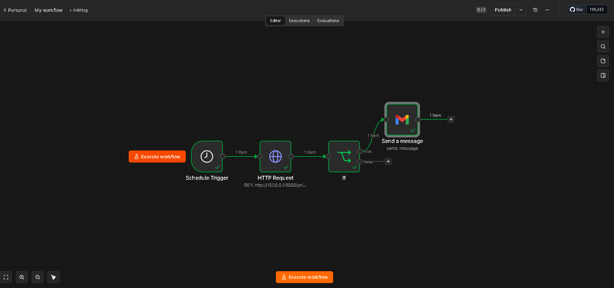

# FastAPI price scraper with n8n integration

A price scraper based on FastAPI with discount warning on email

## Features
- Get the current price of the Vans Knu Skool
- Compare the price with its base-price
- Receive on your email when the shoe is on sale

## Architecture
n8n Schedule Trigger → HTTP Request (FastAPI /preco) → IF price dropped → Gmail notification

## Technologies
- Python 3 
- FastAPI
- Uvicorn
- n8n

## How the n8n Integration Works

The workflow.json file is available in this repository. To replicate or test this automation:

1. Import Workflow: Load workflow.json into your local/cloud n8n instance.
2. Set Webhook / Endpoint: Point the HTTP Node to your API URL.
3. Email Credentials: Configure your preferred SMTP/Gmail credentials in the n8n notification node.

Note on Gmail OAuth: The workflow uses a custom Google Cloud credentials app for Gmail triggers. If testing locally, ensure your SMTP/OAuth credentials are configured inside your n8n environment.

### 1. n8n Execution Pipeline

### 2. Triggered Email Notification

## How to run

Run the script:

pip install -r requirements.txt

uvicorn main:app

